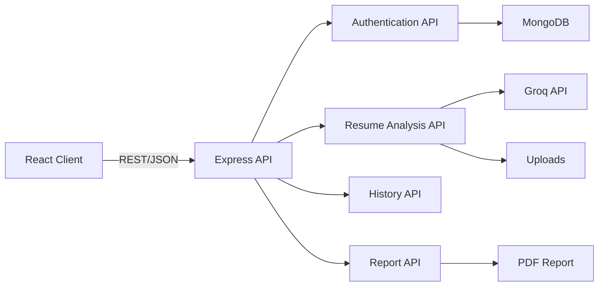
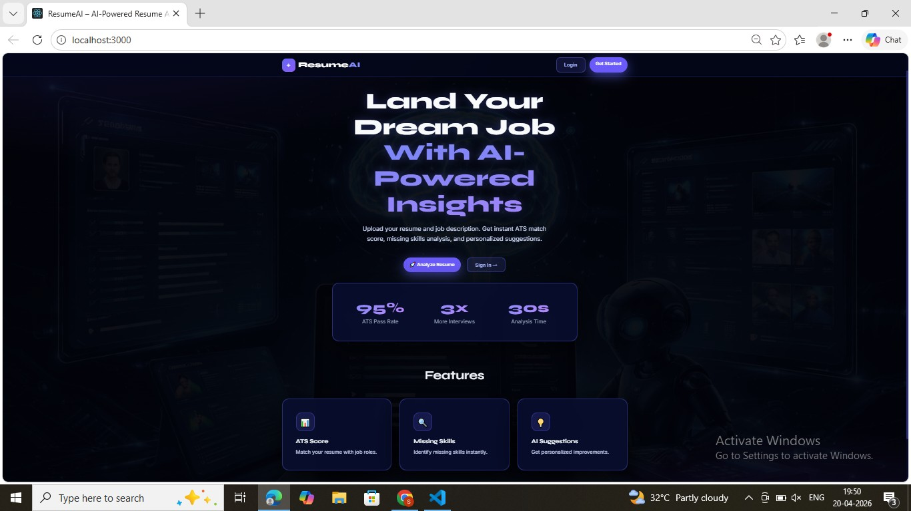
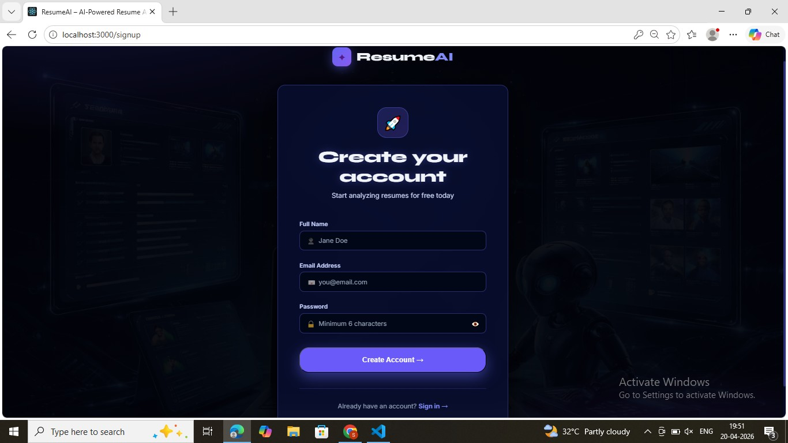
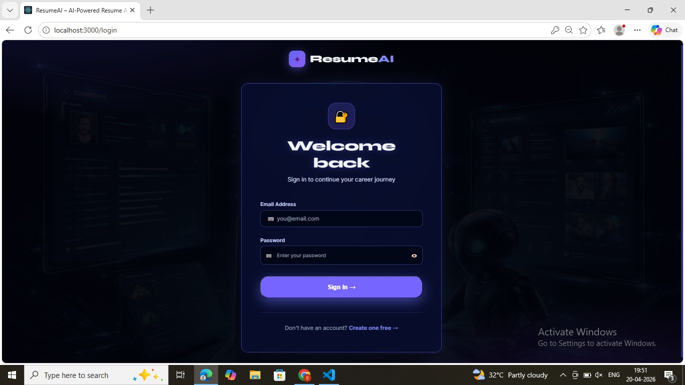
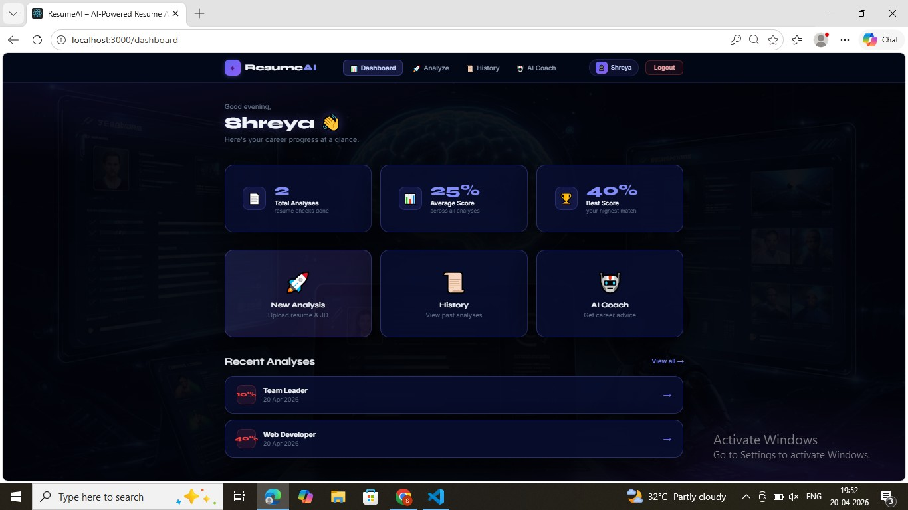
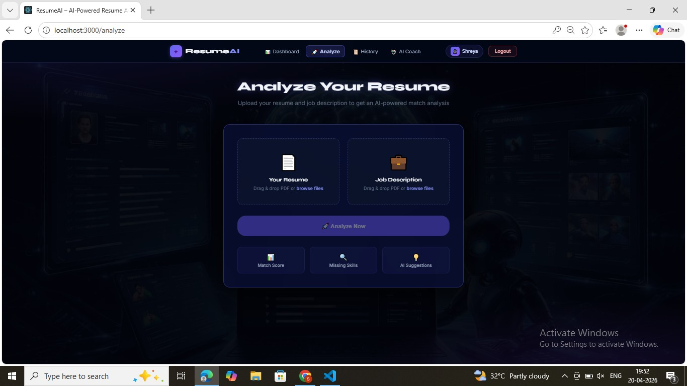
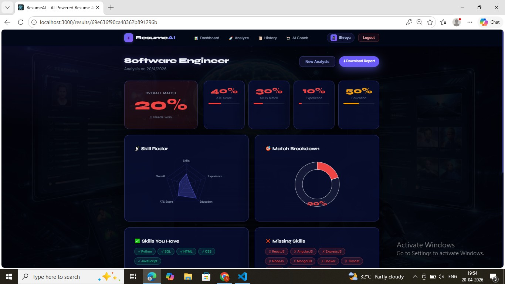
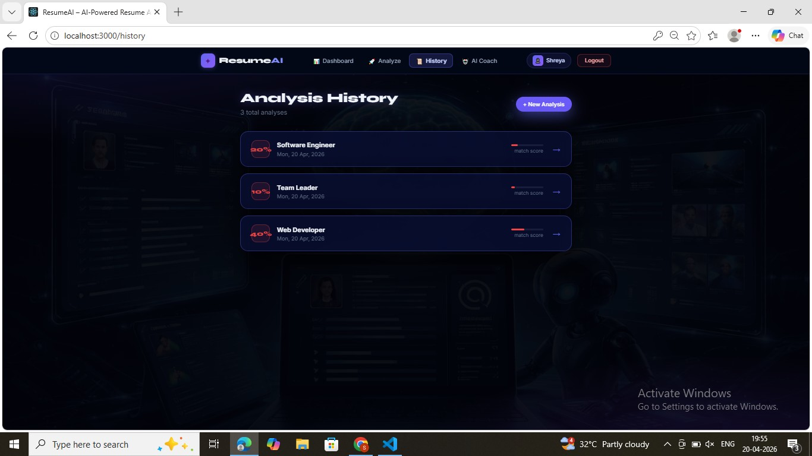
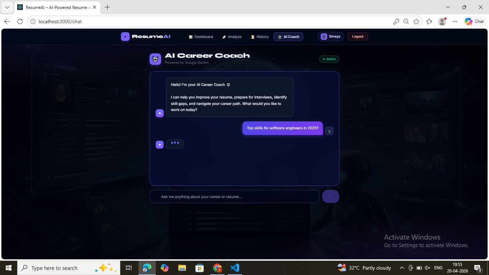
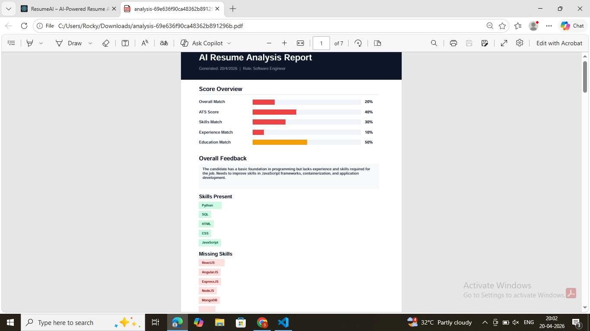

# ResumeAI

[](LICENSE)

A MERN-stack application that analyzes a resume against a job description, scores the match, identifies missing skills, and generates improvement suggestions. Includes an AI chat assistant for ongoing resume and career guidance.

## Table of Contents

- [Project Overview](#project-overview)
- [Features](#features)
- [Technology Stack](#technology-stack)
- [Architecture Overview](#architecture-overview)
- [Project Structure](#project-structure)
- [Getting Started](#getting-started)
- [Installation](#installation)
- [Configuration](#configuration)
- [Running the Project](#running-the-project)
- [Environment Variables](#environment-variables)
- [Usage](#usage)
- [Screenshots](#screenshots)
- [API Overview](#api-overview)
- [Known Limitations](#known-limitations)
- [Contributing](#contributing)
- [License](#license)
- [Author](#author)

## Project Overview

ResumeAI accepts a resume and a job description as PDFs, extracts their text, and sends them to an AI model (via Groq) for comparison. The result includes an overall match score, an ATS score, skills/experience/education breakdowns, a list of missing skills, and specific improvement suggestions. Analyses are stored per user and summarized on a dashboard, with a downloadable PDF report and a chat-based AI career coach.

## Features

- JWT-based authentication (signup/login)
- Resume vs. job description analysis (PDF upload)
- Match score breakdown: overall, ATS, skills, experience, education
- Missing skills detection and improvement suggestions
- Downloadable PDF report of an analysis
- Analysis history and dashboard summary
- AI chat assistant for career and resume questions

## Technology Stack

**Client**: React 18, React Router, Axios, Recharts, React Dropzone, React Hot Toast, Lucide React
**Server**: Node.js, Express, JWT, bcryptjs, Multer
**Database**: MongoDB (Mongoose)
**AI / Processing**: Groq SDK, pdf-parse, PDFKit

## Architecture Overview



Each route module handles one concern (auth, analysis, history, report), all mounted under `/api` in `server.js`.

Further detail: [docs/ARCHITECTURE.md](docs/ARCHITECTURE.md)

## Project Structure

```
ai_based_analyzer/
├── server/
│   ├── server.js
│   ├── routes/
│   │   ├── auth.js
│   │   ├── analyze.js
│   │   ├── history.js
│   │   └── report.js
│   ├── models/
│   │   ├── User.js
│   │   └── Analysis.js
│   ├── middleware/
│   │   └── auth.js
│   ├── uploads/
│   ├── package.json
│   └── .env.example
├── client/
│   ├── public/
│   ├── src/
│   │   ├── App.js
│   │   ├── context/AuthContext.js
│   │   ├── components/Navbar.js
│   │   └── pages/
│   │       ├── Landing.js
│   │       ├── Login.js
│   │       ├── Signup.js
│   │       ├── Dashboard.js
│   │       ├── Analyze.js
│   │       ├── Results.js
│   │       ├── History.js
│   │       └── ChatAssistant.js
│   └── package.json
├── docs/
│   ├── ARCHITECTURE.md
│   ├── API.md
│   ├── INSTALLATION.md
│   └── DEPLOYMENT.md
├── screenshots/
├── .github/
├── .gitattributes
├── .gitignore
├── LICENSE
├── CHANGELOG.md
├── CODE_OF_CONDUCT.md
├── SECURITY.md
├── CONTRIBUTING.md
└── README.md
```

## Getting Started

### Prerequisites

- Node.js 18+
- npm
- MongoDB (local or Atlas)
- A Groq API key

### Clone

```bash
git clone https://github.com/<your-username>/ai_based_analyzer.git
cd ai_based_analyzer
```

## Installation

```bash
cd server
npm install
cp .env.example .env
```

```bash
cd ../client
npm install
```

Full steps: [docs/INSTALLATION.md](docs/INSTALLATION.md)

## Configuration

Edit `server/.env` with your own values (see [Environment Variables](#environment-variables)).

## Running the Project

**Server**
```bash
cd server
npm run dev
```
Runs on `http://localhost:5000`.

**Client**
```bash
cd client
npm start
```
Runs on `http://localhost:3000` and proxies API requests to the server.

## Environment Variables

```env
PORT=5000
MONGO_URI=your_mongodb_connection_string
JWT_SECRET=your_jwt_secret
GROQ_API_KEY=your_groq_api_key
```

| Variable | Description |
|---|---|
| `PORT` | Port the Express server listens on |
| `MONGO_URI` | MongoDB connection string |
| `JWT_SECRET` | Secret used to sign authentication tokens |
| `GROQ_API_KEY` | API key for Groq, used for analysis and the chat assistant |

## Usage

1. Sign up or log in.
2. From the dashboard, start a new analysis.
3. Upload a resume PDF and a job description PDF.
4. Review the match score, skill breakdown, and suggestions on the results page.
5. Optionally download the analysis as a PDF report.
6. Past analyses are available under History.
7. Use the AI chat assistant for further questions.

## Screenshots

| Landing | Signup |
|---|---|
|  |  |

| Login | Dashboard |
|---|---|
|  |  |

| Analysis | Results |
|---|---|
|  |  |

| History | AI Chat Assistant |
|---|---|
|  |  |

| PDF Report |
|---|
|  |

## API Overview

| Method | Endpoint | Auth | Description |
|---|---|---|---|
| POST | `/api/auth/signup` | No | Create an account |
| POST | `/api/auth/login` | No | Log in, receive a JWT |
| GET | `/api/auth/me` | Yes | Get current user |
| POST | `/api/analyze` | Yes | Upload resume and job description, run analysis |
| POST | `/api/analyze/chat` | Yes | Send a message to the AI chat assistant |
| GET | `/api/history` | Yes | List past analyses |
| GET | `/api/history/:id` | Yes | Get one analysis |
| DELETE | `/api/history/:id` | Yes | Delete an analysis |
| GET | `/api/report/:id` | No | Download a PDF report |

Full reference, including request/response examples: [docs/API.md](docs/API.md)

## Known Limitations

- `GET /api/report/:id` has no authentication check; any analysis ID is fetchable if known. See [SECURITY.md](SECURITY.md).
- No automated test suite yet.
- Only PDF uploads are supported for resumes and job descriptions (max 10MB).
- Uploaded files are stored on local disk (`server/uploads/`), which does not scale across multiple server instances.

## Contributing

See [CONTRIBUTING.md](CONTRIBUTING.md) and [CODE_OF_CONDUCT.md](CODE_OF_CONDUCT.md).

## License

MIT — see [LICENSE](LICENSE).

## Author

Shreya
