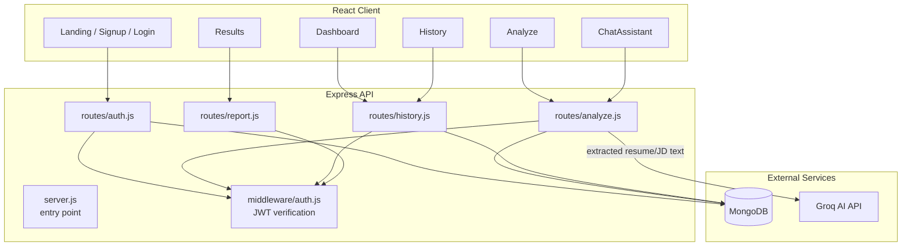
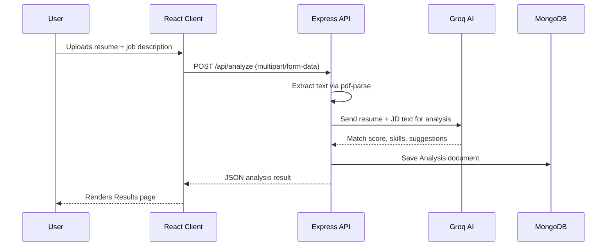

# Architecture

## Overview

ResumeAI is a classic three-tier MERN application: a React SPA client, an Express REST API, and a MongoDB datastore, with an external AI provider (Groq) in the loop for analysis and chat.

## Design Decisions

### Why Express + separate route modules?
Each concern (auth, analyze, history, report) is isolated into its own router, mounted under a versionable `/api/*` prefix in `server.js`. This keeps route files small and testable in isolation.

### Why Groq for AI analysis?
Groq provides fast inference, which matters for a synchronous "upload → analyze → show results" UX. The analysis logic lives entirely in `routes/analyze.js`, so swapping providers only requires changing that one module's AI client and request/response mapping.

### Why MongoDB?
User accounts and analysis history are naturally document-shaped (nested skill lists, scores, feedback), which maps cleanly to Mongoose schemas without a rigid relational structure.

### PDF handling
- **Upload**: `multer` streams uploaded PDFs to `server/uploads/`
- **Extraction**: `pdf-parse` (used directly in `routes/analyze.js`) converts PDF content to plain text for the AI prompt
- **Report generation**: `pdfkit` renders the analysis results back into a downloadable PDF

## Request Lifecycle (Resume Analysis)

## Authentication Flow

JWT tokens are issued on login/signup and expected in the `Authorization` header for protected routes. `middleware/auth.js` verifies the token and attaches the decoded user to `req` before the route handler runs.

## Future Considerations

- Add a caching layer for repeated analyses of the same resume/JD pair
- Move AI prompt construction into a dedicated service module as prompt complexity grows
- Add request validation (e.g. Zod/Joi) at the API boundary
- Add authentication to `/api/report/:id` (tracked in [SECURITY.md](../SECURITY.md))
